# COVID 19 u Hrvatskoj: Pregled broja zaraženih po županijama

### (generirano 23.09.2022. 12:24:24 h)

#### NAPOMENA (04.11.2021.): Stranica se generira automatski. Ako ima grešaka u strojno čitljivim podacima objavljenim na koronavirus.hr, prikazani grafovi neće biti točni. U tom slučaju pokušat ću ih ispraviti čim nađem vremena.

#### NAPOMENA (15.01.2022.): Od danas se koriste podaci iz popisa stanovništva 2021. u svim prikazima u kojima je to moguće. U prikazima po dobnim skupinama i dalje se koriste podaci iz 2019. jer detaljniji podaci još nisu dostupni. Promijenjene su skale na nekim grafovima kako bi bili informativniji.

#### NAPOMENA (24.01.2022.): Promijenjene su skale na nekim grafovima kako bi bili informativniji.

#### NAPOMENA (07.03.2022.): Od danas se koriste podaci iz popisa stanovništva 2021. u svim prikazima.

#### NAPOMENA (12.03.2022.): Zbog nedostupnosti detaljnih podataka o individualnim slučajevima na koronavirus.hr neke grafove nemoguće je generirati. Bit će ispravljeno kad i ako ti podaci ponovno budu dostupni.

#### NAPOMENA (22.09.2022.): Od danas se koriste konačni podaci iz popisa stanovništva 2021. u svim prikazima (ukupan broj stanovnika 3871833).

Neki od prikaza dostupni su i na https://twitter.com/CroatiaCovid odmah nakon generiranja.

Interaktivni prikazi dostupni su na sljedećim linkovima:

- [Standardni prikaz](html/index.html) (zadnjih 100 dana)
- [Prikaz na logaritamskoj skali](html/index_log.html) (zadnjih 100 dana)
- [Prikaz na karti](html/index_map.html) (tjedna promjena, zadnjih 7 i 14 dana na 100000 stanovnika)
- [Prikaz po dobnim skupinama](html/index_per_age.html) (zadnjih 180 dostupnih dana)
- [Prikaz po dobnim skupinama i spolu](html/index_pyramid.html) (zadnjih 7 dostupnih dana, na 100000 stanovnika)
- [Prikaz procijepljenosti na karti](html/index_vaccination.html) (zadnji dostupni podaci, ne osvježava se automatski)

-----

## Pregled broja zaraženih po županijama

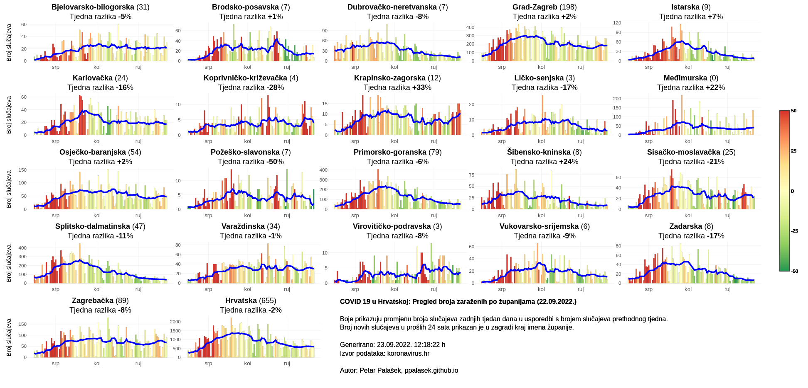

## Pregled tjedne promjene broja zaraženih po županijama

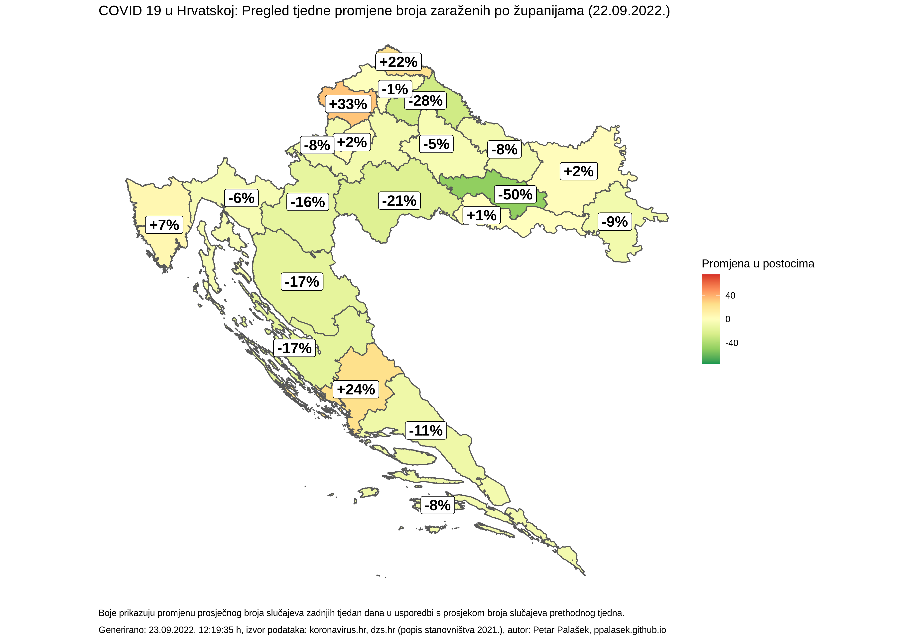

## Kretanje broja umrlih

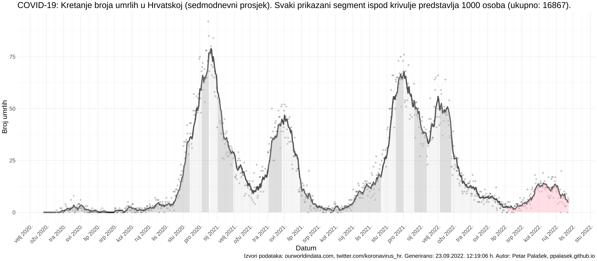

## Kretanje broja COVID-19 slučajeva, hospitalizacija i umrlih

(napomena: podaci o hospitalizacijama i broju osoba na respiratorima se ne objavljuju svakodnevno, prikazani su zadnji dostupni podaci)

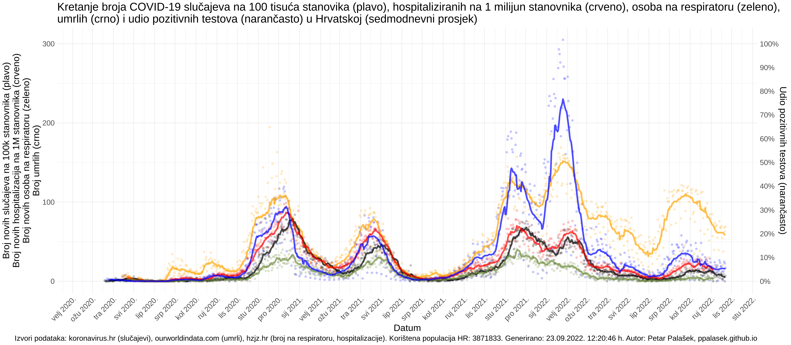

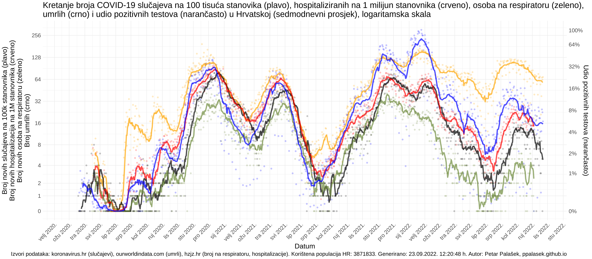

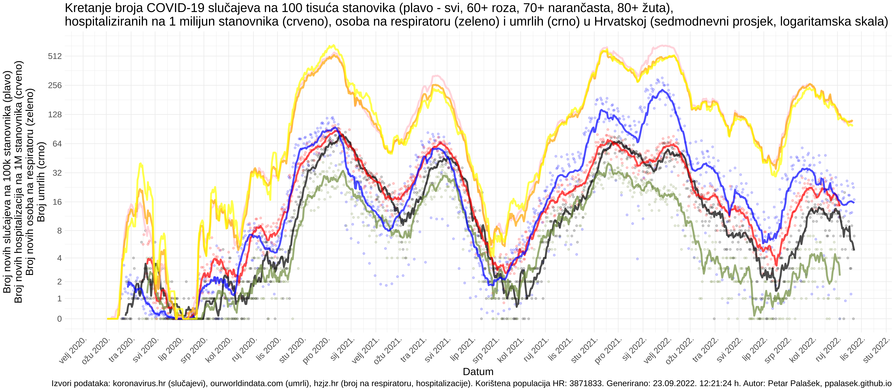

## Kretanje udjela pozitivnih testova

(zadnji dostupni podaci s HZJZ, plavom bojom prikazani su podaci s koronavirus_hr twittera)

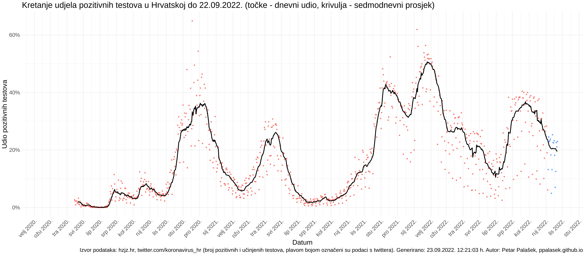

## Kretanje broja učinjenih testova

(zadnji dostupni podaci s HZJZ, plavom bojom prikazani su podaci s koronavirus_hr twittera)

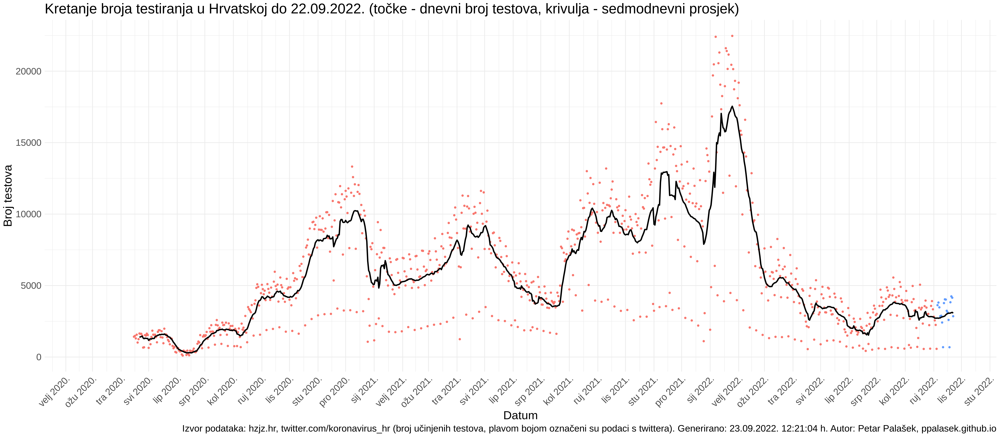

## Kretanje broja COVID-19 slučajeva na 100 tisuća stanovnika po dobnim skupinama

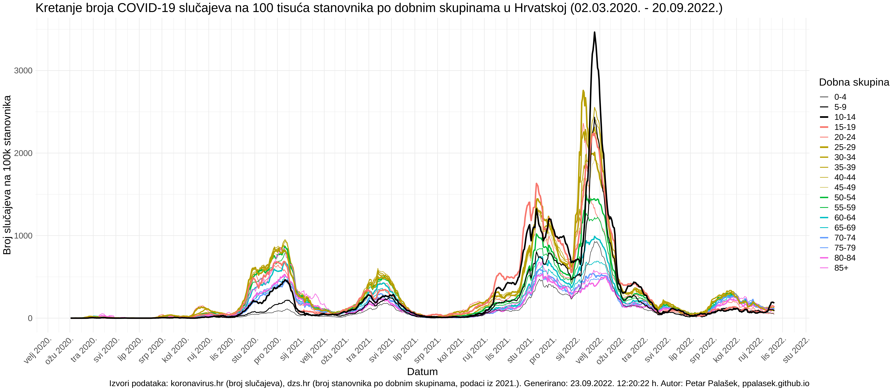

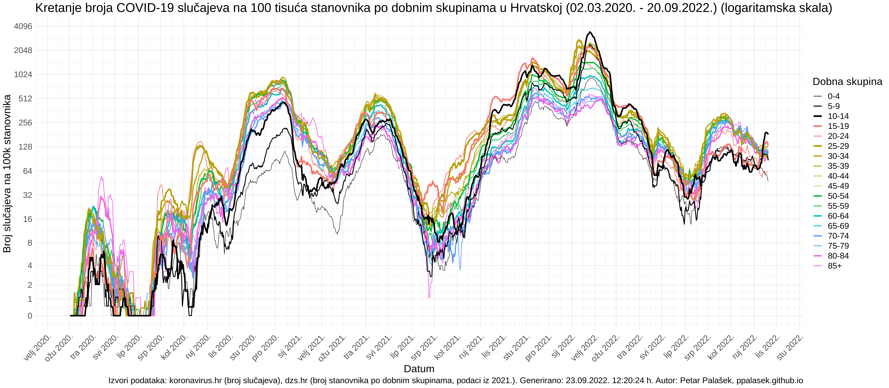

(Incidencija po dobnim skupinama u tablici ispod prikazuje samo broj pozitivnih testova iz službenih podataka o testiranjima u odnosu na ukupan broj stanovnika u svakoj dobnoj skupini. Kako je skup podataka službenih testiranja malen, podaci u tablici ne prikazuju pravu sliku (podcijenjuju pravo stanje) pa apsolutne brojeve treba interpretirati pažljivo. Tablica može biti korisna za praćenje trenda kretanja pozitivnih testova po dobnim skupinama.)

| Dobna skupina | Na 100k stanovnika u 7 dana do 20.09.2022. | 1 na svakih | Promjena u odnosu na prošli tjedan |
| :-----------: | :----------------: | :---------: | :--------------------------------: |
| 0-4 | 47 | 2115 | -26% |
| 5-9 | 87 | 1156 | -14% |
| 10-14 | 182 | 549 | +45% |
| 15-19 | 134 | 746 | +5% |
| 20-24 | 62 | 1607 | +1% |
| 25-29 | 88 | 1138 | -13% |
| 30-34 | 105 | 956 | -13% |
| 35-39 | 130 | 770 | -1% |
| 40-44 | 137 | 730 | +17% |
| 45-49 | 132 | 758 | +7% |
| 50-54 | 107 | 932 | +2% |
| 55-59 | 112 | 893 | +2% |
| 60-64 | 108 | 930 | +11% |
| 65-69 | 106 | 946 | +6% |
| 70-74 | 112 | 890 | +10% |
| 75-79 | 120 | 834 | +6% |
| 80-84 | 95 | 1049 | -2% |
| 85+ | 98 | 1022 | -20% |
## Animirani prikaz kretanja broja COVID-19 slučajeva na 100 tisuća stanovnika po dobnim skupinama

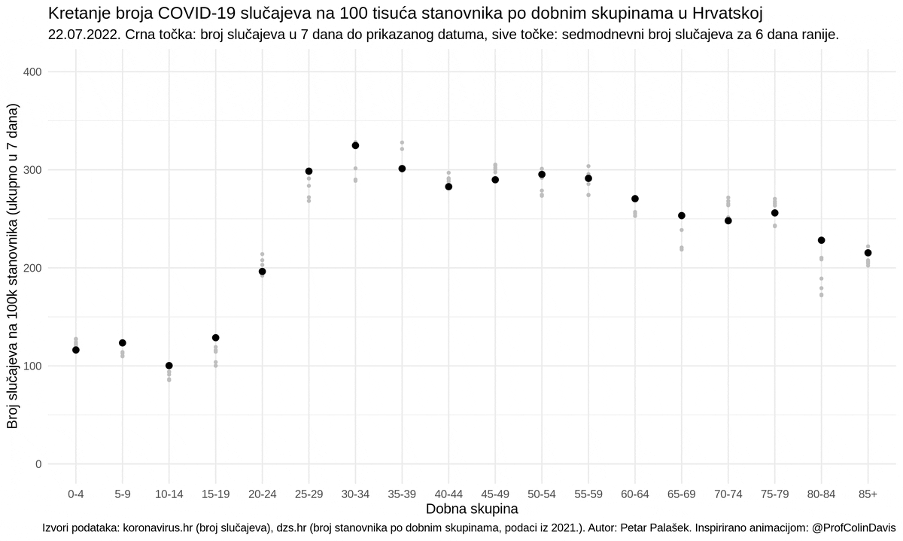

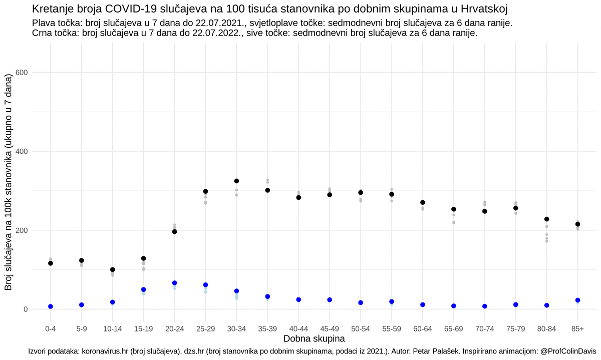

## Ukupan broj zaraženih u zadnjih 7 dana na 100000 stanovnika

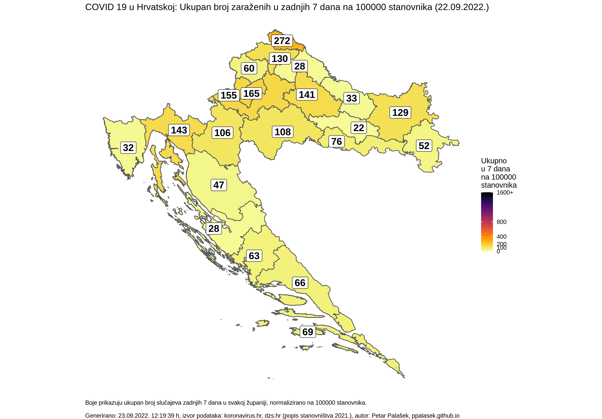

## Ukupan broj zaraženih u zadnjih 14 dana na 100000 stanovnika

## Ukupan broj zaraženih u zadnjih 14 dana na 100000 stanovnika po regijama

(napomena: kod ECDC-a boja regije ovisi i o postotku pozitivnih testova, ovdje je prikazan samo broj slučajeva)

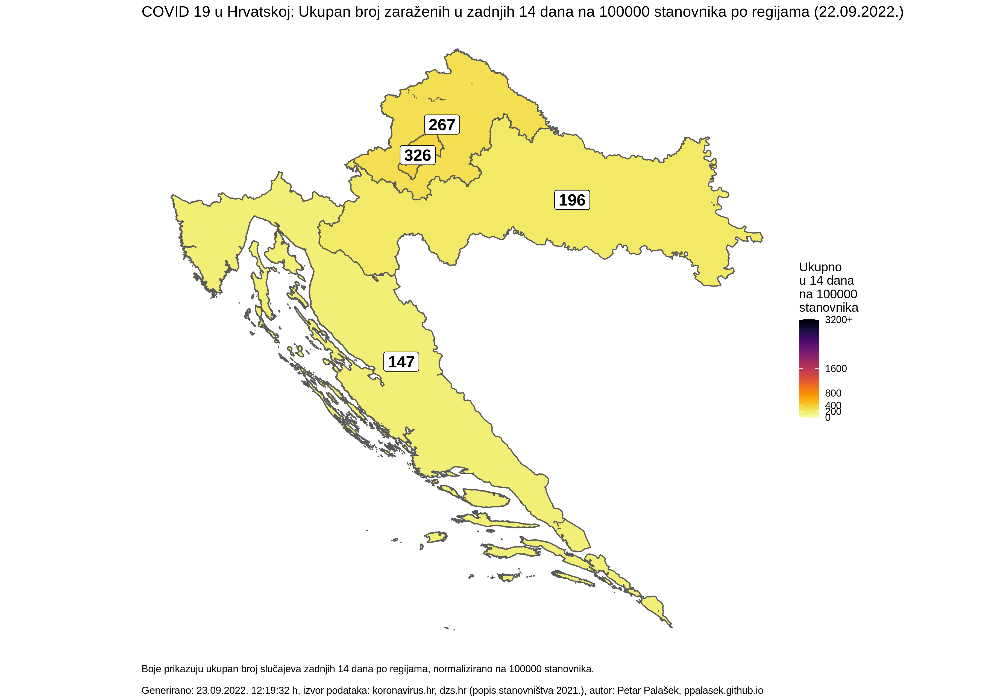

## Ukupan broj zaraženih u zadnjih 7 dana na 100000 stanovnika po dobnim skupinama

(Trend kretanja 14-dnevnog broja slučajeva na 100k stanovnika opisan eksponencijalnom krivuljom n(t) = a * e^(b * t) po regijama. Krivulja aproksimira podatke zadnjih 7 dana, izračunate iz podataka objavljenih na koronavirus.hr, koristeći broj stanovnika po županijama iz 2021. s dzs.hr. Krivulja se prikazuje ukoliko je R^2 aproksimacije > 0.9, prikazana je narančastom bojom. Zelena krivulja prikazuje vrijednosti aproksimacijske krivulje 7 dana u budućnosti (deblja linija), dok su tanjom zelenom linijom prikazane vrijednosti krivulje do dana u kojem bi vrijednost mogla doći do praga od 75/200 zaraženih na 100k stanovnika. Generirano automatski, nakon objave službenih podataka na koronavirus.hr.)

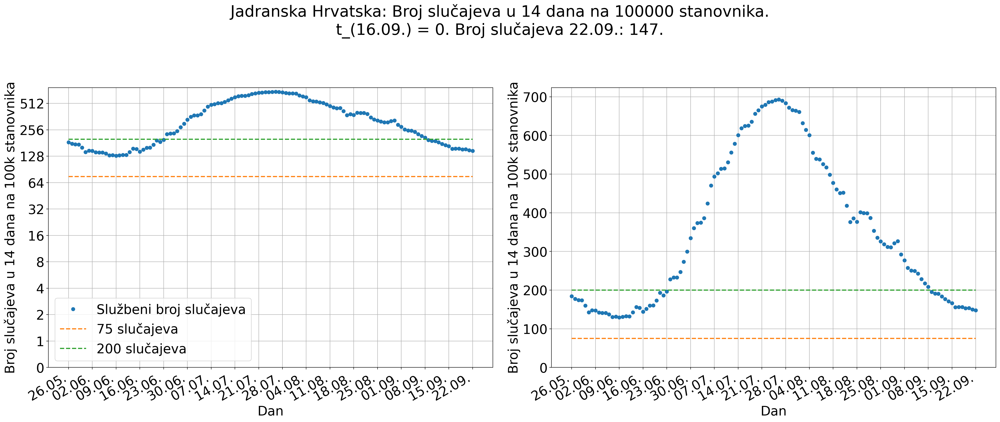

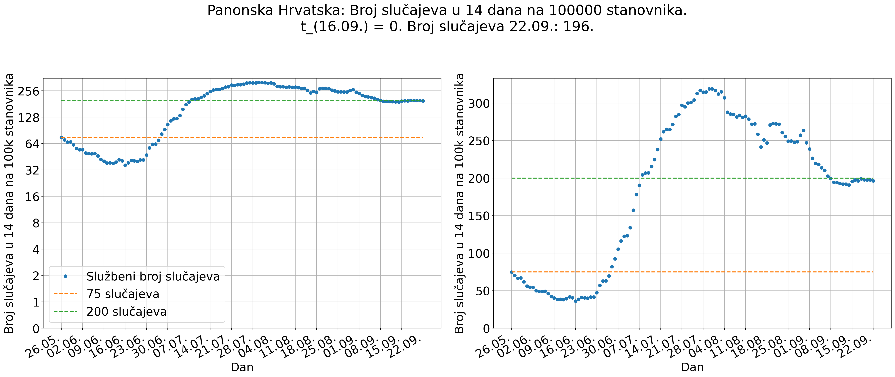

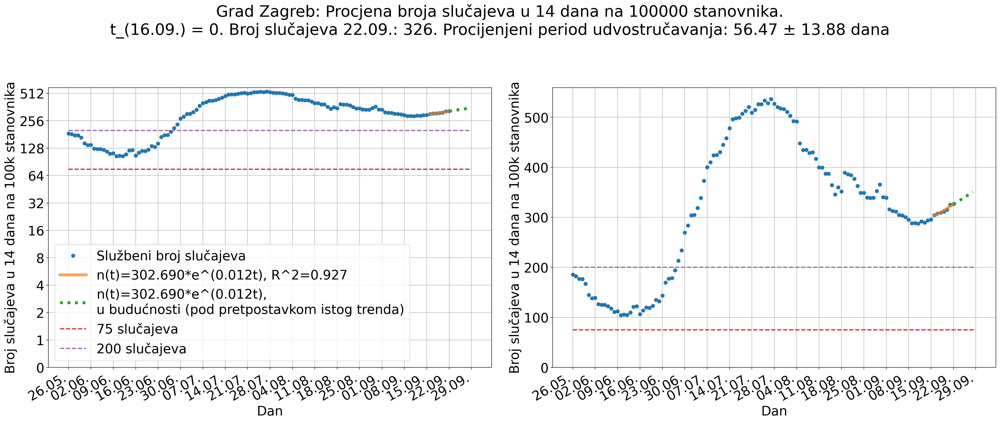

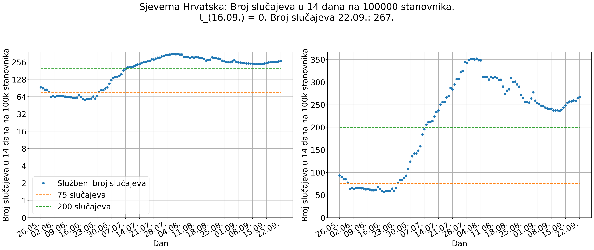

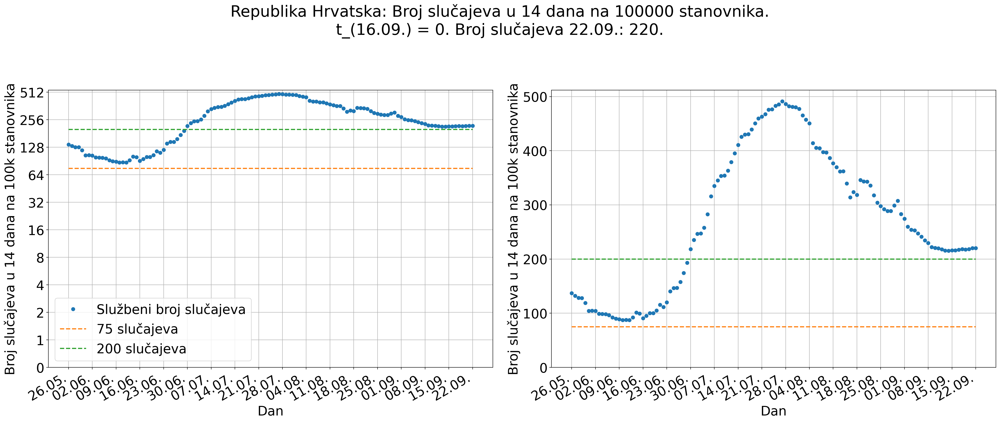

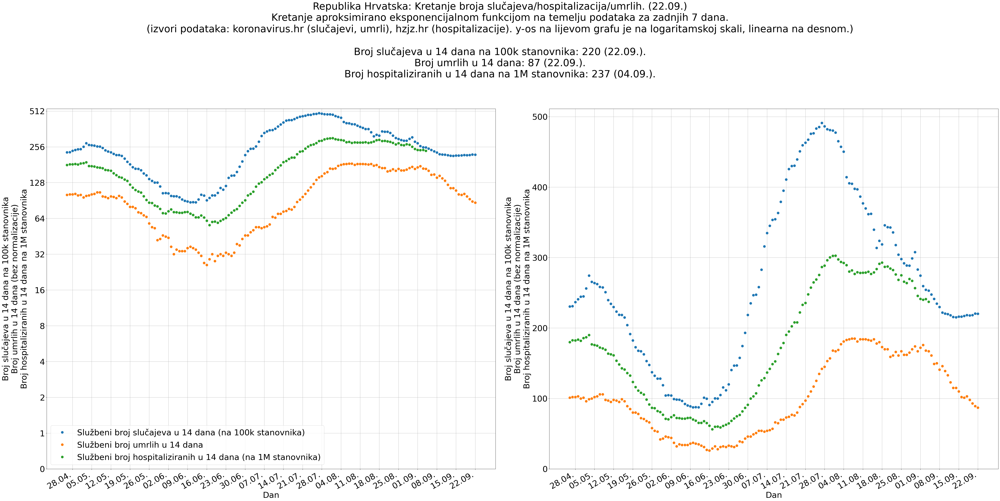

## Procijepljenost po županijama

(ne osvježava se automatski)

## Pregled broja zaraženih po dobnim skupinama na 100000 stanovnika

(Podaci kasne par dana, prikazano stanje nije finalno.)

## Pregled broja zaraženih po dobnim skupinama i spolu (u zadnjih 7 dostupnih dana) na 100000 stanovnika

(Podaci kasne par dana, prikazano stanje nije finalno.)

-----

- [Kod](https://github.com/ppalasek/covid_plots_croatia)

