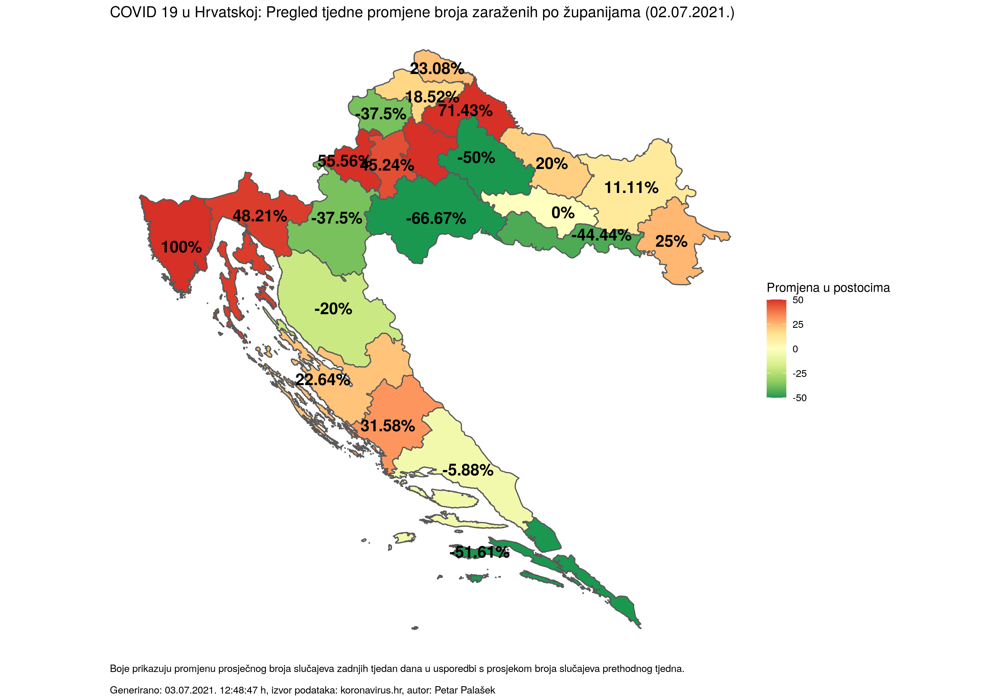
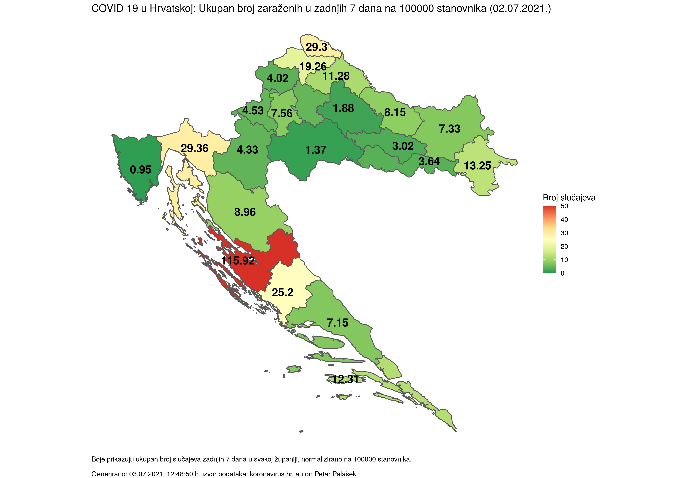

### COVID 19 u Hrvatskoj: Pregled broja zaraženih po županijama

##### (generirano 03.07.2021. 12:49:18 h)

- [Standardni prikaz](html/index.html)
- [Prikaz na logaritamskoj skali](html/index_log.html)
- [Prikaz na karti](html/index_map.html)
- [Prikaz po dobnim skupinama](html/index_per_age.html)

-----

-----

- [Kod](https://github.com/ppalasek/covid_plots_croatia)

