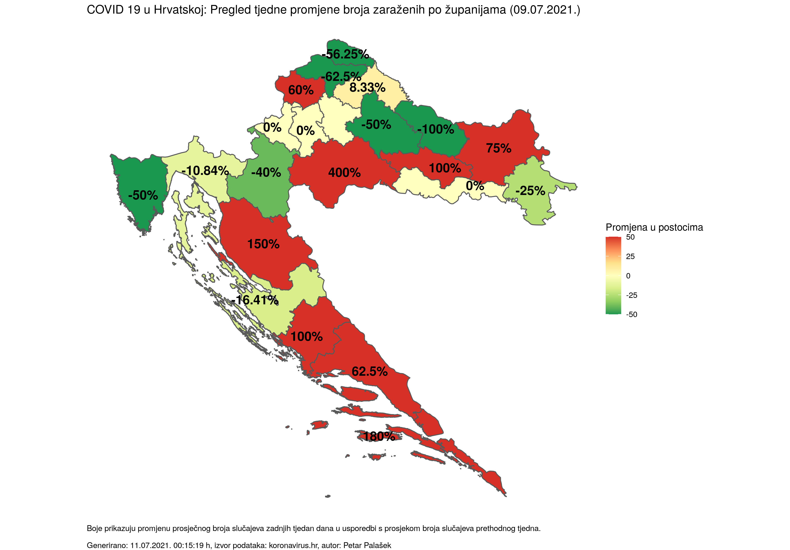
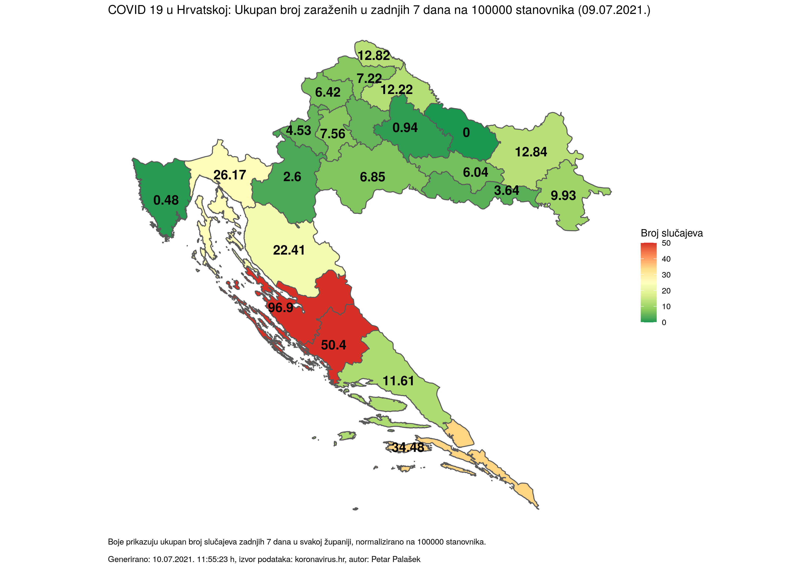
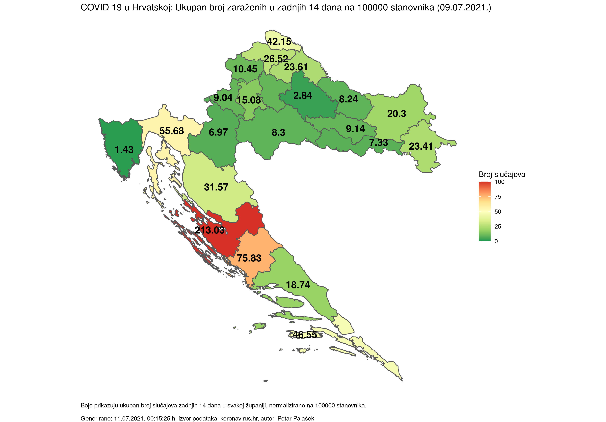
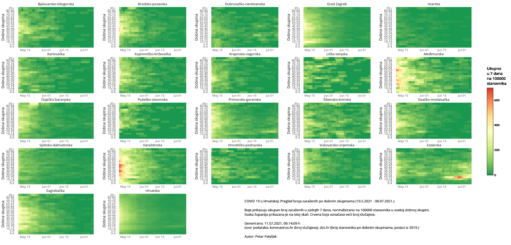
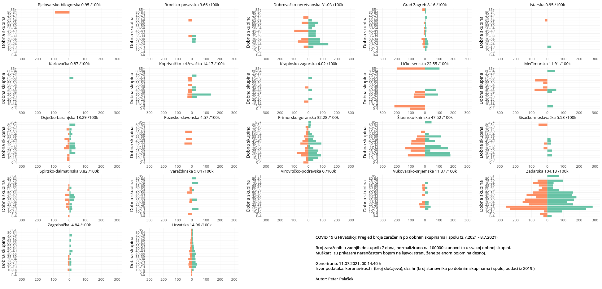

# COVID 19 u Hrvatskoj: Pregled broja zaraženih po županijama

### (generirano 11.07.2021. 00:15:56 h)

Interaktivni prikazi dostupni su na sljedećim linkovima:

- [Standardni prikaz](html/index.html) (zadnjih 60 dana)
- [Prikaz na logaritamskoj skali](html/index_log.html) (zadnjih 60 dana)
- [Prikaz na karti](html/index_map.html) (tjedna promjena, zadnjih 7 i 14 dana na 100000 stanovnika)
- [Prikaz po dobnim skupinama](html/index_per_age.html) (zadnjih 60 dostupnih dana)
- [Prikaz po dobnim skupinama i spolu](html/index_pyramid.html) (zadnjih 7 dostupnih dana, na 100000 stanovnika)

-----

-----

- [Kod](https://github.com/ppalasek/covid_plots_croatia)

