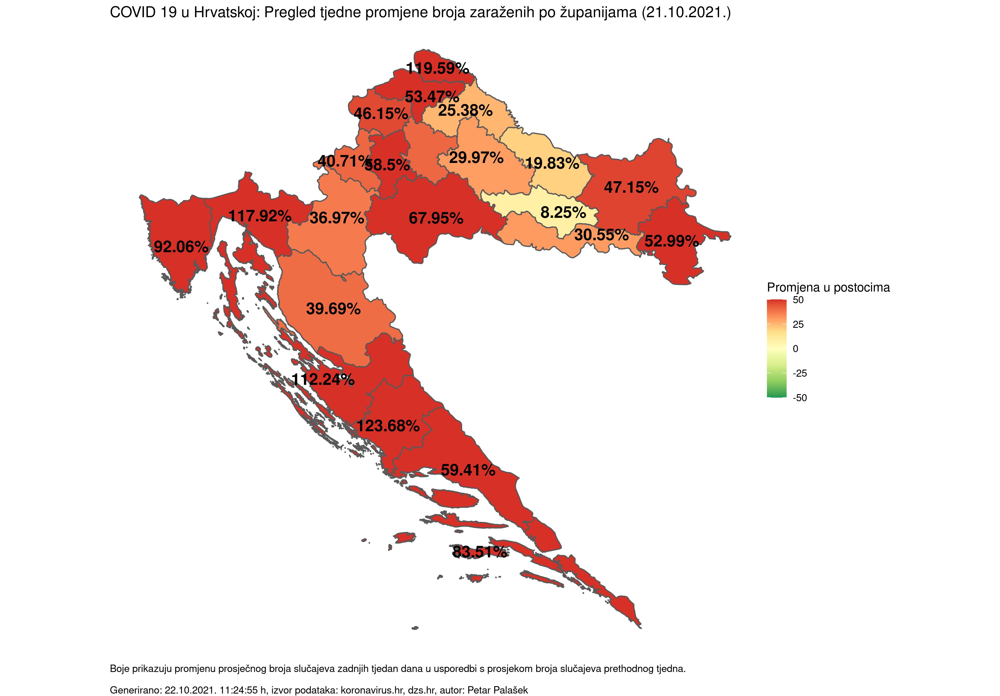
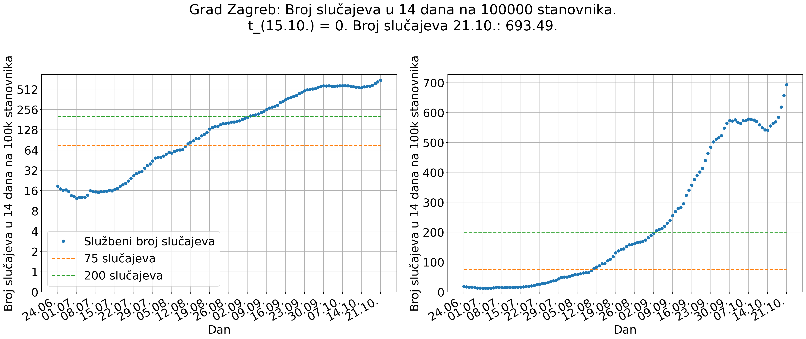
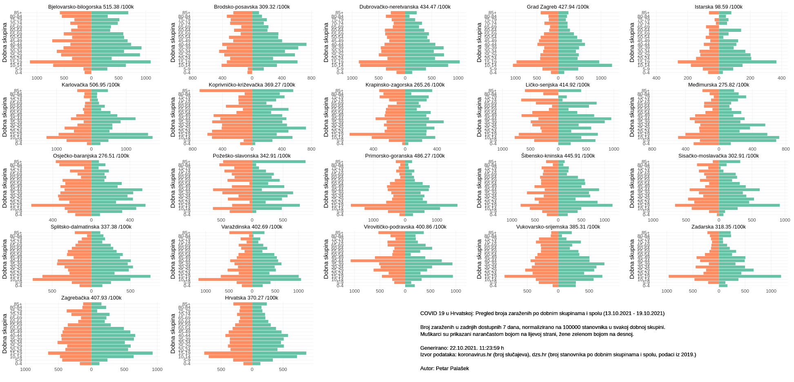

# COVID 19 u Hrvatskoj: Pregled broja zaraženih po županijama

### (generirano 22.10.2021. 11:25:10 h)

### ~~NAPOMENA (01.09.2021.): Stranica se generira automatski. Zbog grešaka u strojno čitljivim podacima objavljenim na koronavirus.hr za zadnjih par dana neki od prikaza NISU TOČNI (npr. negativan broj slučajeva rezultira krivim postocima tjedne promjene) - bit će ispravljeno čim nađem vremena.~~

### NAPOMENA (03.09.2021.): Krivi podaci su manualno ispravljeni, trebalo bi sve biti OK.

Interaktivni prikazi dostupni su na sljedećim linkovima:

- [Standardni prikaz](html/index.html) (zadnjih 100 dana)
- [Prikaz na logaritamskoj skali](html/index_log.html) (zadnjih 100 dana)
- [Prikaz na karti](html/index_map.html) (tjedna promjena, zadnjih 7 i 14 dana na 100000 stanovnika)
- [Prikaz po dobnim skupinama](html/index_per_age.html) (zadnjih 180 dostupnih dana)
- [Prikaz po dobnim skupinama i spolu](html/index_pyramid.html) (zadnjih 7 dostupnih dana, na 100000 stanovnika)
- [Prikaz procijepljenosti na karti](html/index_vaccination.html) (zadnji dostupni podaci, ne osvježava se automatski)

-----

## Pregled broja zaraženih po županijama

## Pregled tjedne promjene broja zaraženih po županijama

## Kretanje broja COVID-19 slučajeva, hospitalizacija i umrlih

## Kretanje broja COVID-19 slučajeva na 100 tisuća stanovnika po dobnim skupinama

## Animirani prikaz kretanja broja COVID-19 slučajeva na 100 tisuća stanovnika po dobnim skupinama

## Ukupan broj zaraženih u zadnjih 7 dana na 100000 stanovnika

## Ukupan broj zaraženih u zadnjih 14 dana na 100000 stanovnika

## Ukupan broj zaraženih u zadnjih 14 dana na 100000 stanovnika po regijama

(napomena: kod ECDC-a boja regije ovisi i o postotku pozitivnih testova, ovdje je prikazan samo broj slučajeva)

(Trend kretanja 14-dnevnog broja slučajeva na 100k stanovnika opisan eksponencijalnom krivuljom n(t) = a * e^(b * t) po regijama. Krivulja aproksimira podatke zadnjih 7 dana, izračunate iz podataka objavljenih na koronavirus.hr, koristeći broj stanovnika po županijama iz 2019. s dzs.hr. Krivulja se prikazuje ukoliko je R^2 aproksimacije > 0.95, prikazana je narančastom bojom. Zelena krivulja prikazuje vrijednosti aproksimacijske krivulje 7 dana u budućnosti (deblja linija), dok su tanjom zelenom linijom prikazane vrijednosti krivulje do dana u kojem bi vrijednost mogla doći do praga od 75/200 zaraženih na 100k stanovnika. Generirano automatski, nakon objave službenih podataka na koronavirus.hr.)

## Procijepljenost po županijama

(ne osvježava se automatski)

## Pregled broja zaraženih po dobnim skupinama na 100000 stanovnika

(Podaci kasne par dana, prikazano stanje nije finalno.)

## Pregled broja zaraženih po dobnim skupinama i spolu (u zadnjih 7 dostupnih dana) na 100000 stanovnika

(Podaci kasne par dana, prikazano stanje nije finalno.)

-----

- [Kod](https://github.com/ppalasek/covid_plots_croatia)

